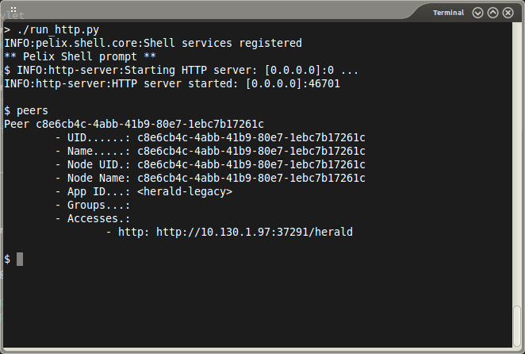
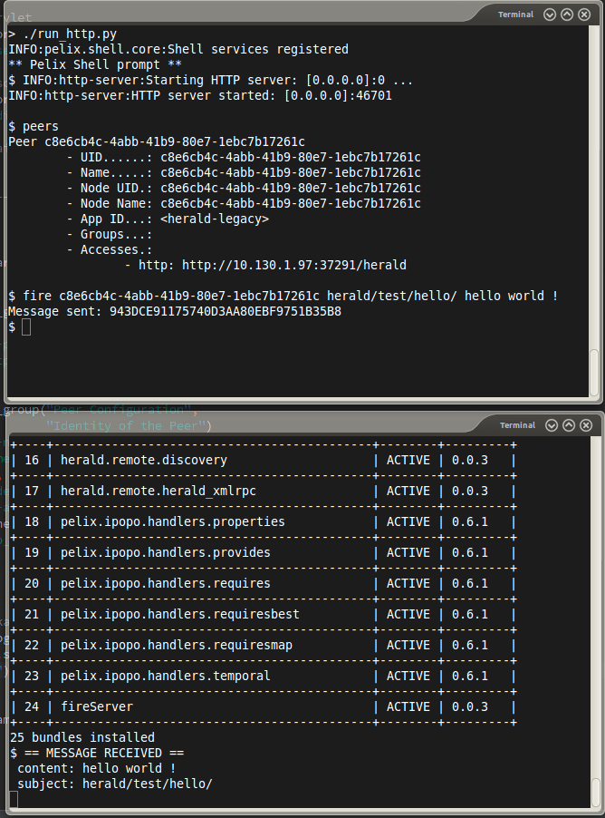

Herald Tutorial
===============

About the Fire command
----------------------

### Introduction

In this tutorial, we are going to see how to use the 'fire' command in Herald. The fire command sends a message to a peer without checking if it has been received.

We will implement a simple server that displays messages it get and a client that sends messages every seconds.

We will also send messages directly from the shell.

(all the source code is available on [github](https://github.com/librallu/cohorte-herald/blob/master/python/tuto_fire.rst))

### Server Side

Starting by the imports:

~~~~ {.sourceCode .python}
# iPOPO component decorators
from pelix.ipopo.decorators import ComponentFactory, Provides, Property

import herald
~~~~

And the component:

~~~~ {.sourceCode .python}
@ComponentFactory("herald-fire-server-factory")
@Provides(herald.SERVICE_LISTENER)
@Property('_filters', herald.PROP_FILTERS, ['herald/test/hello/*'])
@Instantiate('herald-fire-server')
class FireServer:
    """
    A simple component that have a function that returns the number
    of usages of this function.
    """

    def __init__(self):
        # properties
        self._filters = None
~~~~

We can see that it provides the SERVICE\_LISTENER specification from herald and a property PROP\_FILTERS. It tells to the core that the component listens to messages with the subjects matching `herald/test/hello/*`.

> **warning**
>
> some subjects are reserved for the system
>
> The subjects `herald/error`, `herald/routing` and `herald/directory` are reserved by the system and should not be used in applications.

To listen to the messages, we also need a method that will be called every time the component gets a matching message:

~~~~ {.sourceCode .python}
def herald_message(self, herald_svc, message):
    """
    An herald message has been received!
    :param herald_svc: The Herald core service
    :param message: The representation of the message
    """
    print("== MESSAGE RECEIVED ==")
    print(" content: ", message.content)
    print(" subject: ", message.subject)
    print(" message UID: ", message.uid)
    subject = 'herald/test/hello/reply/'
    herald_svc.reply(message, None, subject=subject)
~~~~

This method takes two parameters :

-   **herald\_svc** which is the herald service that provided the message.
-   **message** The message bean (i.e. the message data and metadata)

In this method, we display the content and the subject and also reply to this message with the method `herald_svc.reply`.

### Tests with the Console

#### Starting the server

In a first step, we launch an herald shell session and instantiate the fireServer with the following command in a linux shell: `./run_http.py`.

It will launch a herald shell.

Now we can type the command `install fireServer` that finds the *fireServer.py* file and create the according bundle. We can see that the new bundle has the 24th ID.

We can start the bundle with the `start 24` command. It will create an instance of the fireServer component.

> **note**
>
> visualize the instantiate bundles
>
> It is possible to visualize the installed and active bundles with the *bl* command (*b*undle *l*ist)
>
> In this case, we have an output like :

#### Sending a message via the console

We start a new terminal, run `run_http.py` and display the list of peers with the `peers` command.

We can see our server in the list.

We can fire a message to our server with the command `fire`. The `fire` command takes the destination UID as first parameter (we got it from the previous `peers` command). It also takes a subject (here *herald/test/hello/* because it is the subjects our server listens to) It finally takes a third argument that is the content of the message.

As we can see, the server receives correctly our message.

### Conclusions

So far, we can run a herald shell, instantiate components, and handle messages with a filter on the subject.
