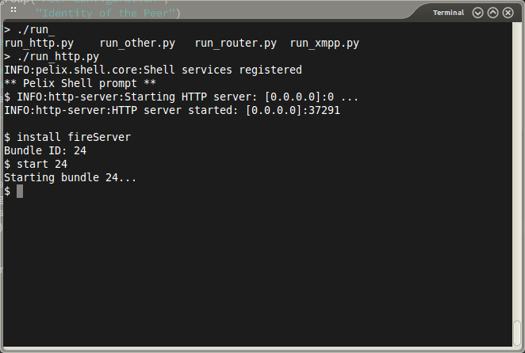
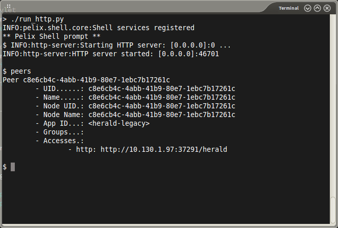
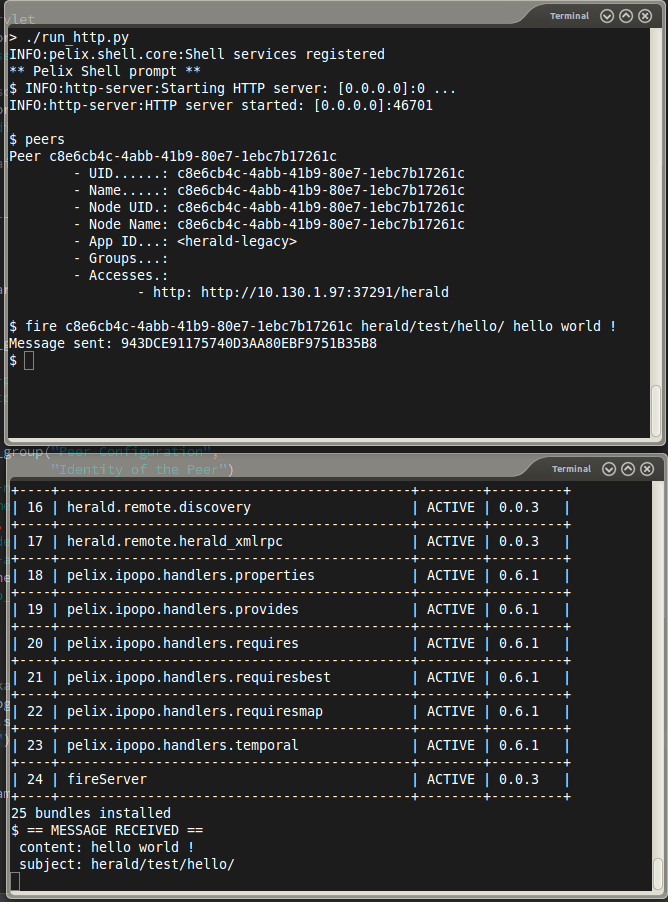

===============
Herald Tutorial
===============

----------------------
About the Fire command
----------------------

Introduction
============

In this tutorial, we are going to see how to use
the 'fire' command in Herald. The fire command
send a message to a peer without checking
if it has been received.

We will implement a simple server that displays
messages it get and a client that sends messages
every seconds.

We will also send messages directly from the shell.

(all the source code is available on github **TODO: URLS here**)

Server Side
===========

Starting by the imports :

.. code-block:: python

    from pelix.ipopo.decorators import ComponentFactory, Provides, Property

    import herald

And the component :

.. code-block:: python

    @ComponentFactory("herald-fire-server-factory")
    @Provides(herald.SERVICE_LISTENER)
    @Property('_filters', herald.PROP_FILTERS, ['herald/test/hello/*'])
    @Instantiate('herald-fire-server')
    class FireServer:
        """
        A simple component that have a function that returns the number
        of usages of this function.
        """

        def __init__(self):
            # properties
            self._filters = None

We can see that it provides the SERVICE_LISTENER from herald and
a property PROP_FILTERS. It tells to the core that the component
listens to messages with the subjects matching 'herald/test/hello/*'.

.. warning:: some subjects are reserved for the system

    The subjects *herald/error*, *herald/routing* and *herald/directory*
    are reserved by the system and should not be used in applications.

For listening to the messages, we also need a method that will
be called every time the component gets a message :

.. code-block:: python

    def herald_message(self, herald_svc, message):
        """
        A herald message has been received !
        :param herald_svc:
        :param message:
        :return:
        """
        print("== MESSAGE RECEIVED ==")
        print(" content: "+message.content)
        print(" subject: "+message.subject)
        subject = 'herald/test/hello/reply/'
        herald_svc.reply(message, None, subject=subject)

This method takes two parameters :

- **herald_svc** which is the herald service that provided the message.
- **message** The message bean (i.e. the message data)

In this method, we display the content and the subject and also reply to this message
with the command *herald_svc.reply*.

Tests with the Console
======================

starting the server
-------------------

In a first step, we launch a herald shell session and instantiate the fireServer
with the following commands :

In a linux shell, the file *run_http.py*.

It will launch a herald shell.

Now we can type the command *install fireServer* that finds the *fireServer.py* file and
create the according bundle. We can see that the new bundle has the 24th ID.

We can start the bundle with the *start 24* command.
It will create an instance of the fireServer component.

.. note:: visualize the instantiate bundles

    It is possible to visualize the installed and instantiate bundles
    with the *bl* command (*b*undle *l*ist)

    In this case, we have an output like :

    .. parsed-literal::

        $ bl
        +----+--------------------------------------------+--------+---------+
        | ID |                    Name                    | State  | Version |
        +====+============================================+========+=========+
        | 0  | pelix.framework                            | ACTIVE | 0.6.1   |
        +----+--------------------------------------------+--------+---------+
        | 1  | pelix.ipopo.core                           | ACTIVE | 0.6.1   |

        ...

        +----+--------------------------------------------+--------+---------+
        | 21 | pelix.ipopo.handlers.requiresbest          | ACTIVE | 0.6.1   |
        +----+--------------------------------------------+--------+---------+
        | 22 | pelix.ipopo.handlers.requiresmap           | ACTIVE | 0.6.1   |
        +----+--------------------------------------------+--------+---------+
        | 23 | pelix.ipopo.handlers.temporal              | ACTIVE | 0.6.1   |
        +----+--------------------------------------------+--------+---------+
        | 24 | fireServer                                 | ACTIVE | 0.0.3   |
        +----+--------------------------------------------+--------+---------+

Sending a message via the console
---------------------------------

We start a new terminal, run *run_http.py* and
display the list of peers with the *peers* command.

We can see our server in the list.

We can fire a message to our server with the command *fire*.
The fire command take The destination UID (we get it from the previous *peers* command.
It also takes a subject (here *herald/test/hello/* because it is the subjects our server listens)
It finally takes a third argument that is the content of the message.

As we can see, when the server receives correctly our message.

Conclusions
===========

So far, we can run a herald shell, instantiate components, and handle messages with a filter on the subject.