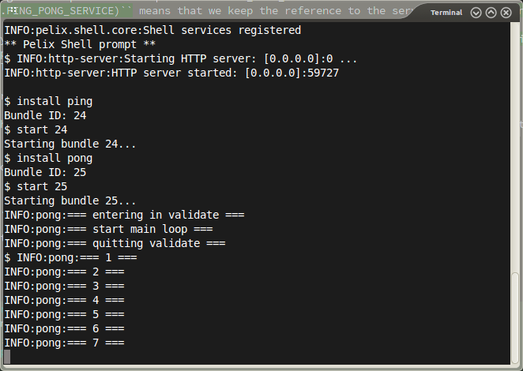

Herald Tutorial
===============

About Remote Services
---------------------

In this tutorial, we will show a simple use of *Herald Remote Services* with an application called *ping/pong*.

This tutorial purpose is to show how to call methods from an other component. It also show how to run a thread in a component for repetitive tasks.

For this, we have two components :

-   `ping.py` that provides a PING\_PONG\_SERVICE. In this case, it's just a method that counts the number of calls. i.e. At first call, it will return 1, at second call, it will return 2 etc.
-   `pong.py` that requires a PING\_PONG\_SERVICE. It will call it every period of time and display the result of the call with some formatting.

So we will see something like this in the `pong.py` output :

### Implementation of ping.py

imports used and name definition of PING\_PONG\_SERVICE:

~~~~ {.sourceCode .python}
from pelix.ipopo.decorators import ComponentFactory, Provides, \
    Validate, Invalidate, Instantiate

PING_PONG_SERVICE = "herald.test.ping_pong"
~~~~

Now, we can declare our PingTest component.

It provides a PING\_PONG\_SERVICE and contains following methods :

-   `__init__:` constructor of the component. Note : we declare attributes by setting them to None by convention.
-   `validate:` that is called when the component has all it's requires satisfied. In this case, we haven't any require so, it will be called as soon as it's started.
-   `invalidate:` that is called when some requirements are not satisfied anymore. In this case, as we haven't any require, it won't be called.
-   `ping:` method provided by the PING\_PONG\_SERVICE. Note that in python, we don't define anywhere that the count method is linked to the PING\_PONG\_SERVICE. This method is supposed to be present when the component provides PING\_PONG\_SERVICE. For this problem, Java uses Interfaces to force the method to be present.

~~~~ {.sourceCode .python}
@ComponentFactory("herald-ping-test-factory")
@Provides(PING_PONG_SERVICE)
@Instantiate('herald-ping-test')
class PingTest:
    """
    A simple component that have a function that returns the number
    of usages of this function.
    """

    def __init__(self):
        self._count = None

    @Validate
    def validate(self, _):
        """
        when all the requirements are satisfied.
        :param _: context
        :return: nothing
        """
        self._count = 0

    @Invalidate
    def invalidate(self, _):
        """
        when some requirements are unsatisfied
        :param _: context
        :return: nothing
        """
        self._count = None

    def ping(self):
        """
        Dummy function that counts the numbers of calls
        it had.
        :return: number of calls it had
        """
        self._count += 1
        return self._count
~~~~

That's all for the PingTest component !

### Implementation of pong.py

We make imports and define our logger :

~~~~ {.sourceCode .python}
from pelix.ipopo.decorators import ComponentFactory, \
    Validate, Invalidate, Instantiate, Property, Requires
import logging
import threading
import time
import ping

# ------------------------------------------------------------------------------

_logger = logging.getLogger(__name__)

# ------------------------------------------------------------------------------
~~~~

Now, we can define our ping test component. It requires the PING\_PONG\_SERVICE. We can see that the line `@Requires('_ping', ping.PING_PONG_SERVICE)` means that we keep the reference to the service in the `_ping` variable.

We also have the @Property that means we have a parameter with our component. The line says that in the `_interval` variable, we have the property 'time\_interval' of value 2. It is defined here because we can replace it in the launcher for instance. We can also apply filters on services with properties.

In `__init__`, we declare attributes, remote objects and properties to None.

In `validate`, we set the `_active` field to true. When this attribute is set to false, the loop will stop at the next iteration. Then, we start the thread executing the \_loop method. It's a better way than stopping directly the thread because we wait for the loop to end.

In `invalidate`, we set `_active` to False to terminate the loop and wait for the thread with the `join` command.

Finally, the `_loop` method wait for some time defined by the `time_interval` property and call the `count` method from the PING\_PONG\_SERVICE.

~~~~ {.sourceCode .python}
@ComponentFactory("herald-pong-test-factory")
@Requires('_ping', ping.PING_PONG_SERVICE)
@Property('_interval', 'time_interval', 2)
@Instantiate('herald-pong-test')
class PingTest:
    """
    A simple component that asks for a remote service each time interval
    """

    def __init__(self):
        # private objects
        self._loop_thread = None    # looping thread
        self._active = None         # True if looping thread active

        # remote objects
        self._ping = None

        # properties
        self._interval = None       # time interval between two calls

    @Validate
    def validate(self, _):
        """
        when all the requirements are satisfied.
        :param _: context
        :return: nothing
        """
        _logger.info("=== entering in validate ===")
        self._active = True
        self._loop_thread = threading.Thread(target=self._loop, args=())

        # launching daemon thread
        self._loop_thread.start()
        _logger.info("=== quitting validate ===")

    @Invalidate
    def invalidate(self, _):
        """
        when some requirements are unsatisfied
        :param _: context
        :return: nothing
        """
        _logger.info("=== entering in invalidate ===")
        self._active = False
        # wait for looping thread to stop current iteration
        self._loop_thread.join()
        _logger.info("=== quitting invalidate ===")

    def _loop(self):
        _logger.info("=== start main loop ===")
        while self._active:
            # wait a moment
            time.sleep(self._interval)
            # call ping
            _logger.info("=== "+str(self._ping.ping())+" ===")
~~~~

### Execution

We execute the ping and the pong components and get the following output :

