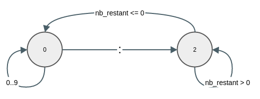

Bluetooth
=========

Cette partie présente le transport bluetooth présent dans *Herald*.

A l'interieur sont présents plusieurs modules :

 - *Beans* représente l'accès par Bluetooth qui est représenté par une adresse MAC
 - *Bluetooth Manager* est l'aspect haut niveau du module bluetooth. C'est lui qui
   est utilisé par les applications pour envoyer un message herald
   aux différents peers bluetooth. Il permet aussi de reçevoir les messages arrivant
   par bluetooth grâce à un système de callback.
 - *Communication Set* est utilisé pour aggréger plusieurs liaisons bluetooth simultanément
   il donne également accès à des callback pour savoir quand une connection bluetooth à démarré.
 - *Connection* représente l'aspect bas niveau du module bluetooth. Il ping régulièrement les devices
   pour s'assurer qu'ils sont toujours en vie. Si ce n'est pas le cas, il désactive la
   connection et notifie par callback qu'une connexion a été enlevée.
 - *Directory* fait le lien entre l'uuid du peer et son adresse bluetooth.
 - *Discovery* est chargé de
   détecter si il y a des nouveaux devices bluetooth sur le réseau, de leur envoyer un
   message de détection afin de s'assurer que celui-ci est bien un peer herald et enfin
   notifie qu'une connection à pu être établie.
 - *Serial Automata* est aussi présent du côté pyboard. Il permet de traduire une suite de
   messages en une suite de caractères et de les recomposer.
 - *Serial Herald Message* représente des messages herald passant par une liaison série.
   Un message herald sur la liaison série correspond à une suite de messages série
   assemblés dans un certain ordre.
 - *Transport* est l'interface herald du module bluetooth. Il livre
   des primitives permettant d'envoyer des messages herald à un peer par bluetooth.

On note que le fait d'utiliser les messages herald par la liaison série permet d'augmenter
considérablement la vitesse de traitement de ceux-ci sur la pyboard. Il est possible de
traiter les messages codés en JSON, mais chaque message met plusieurs secondes à être traité.
Cela est particulièrement problématique si le flux d'arrivée des messages est plus grand
que le flux de sortie. Cela entraînerait une saturation de la mémoire de la pyboard et
causerait des retards importants dans le temps de réponse. Il est donc important lors
de la conception de ce genre de système de faire attention à ce que le flux d'entrée moyen
soit strictement inférieur au flux de sortie moyen. C'est pour cela que les messages herald
passe par liaison série.

Les messages série sont représentés de la façon suivante :

 - Un entier représentant la taille du message notée :math:`n`.
 - Un caractère de délimitation. ':' est utilisé.
 - Une suite de caractères représentant le corps du message. Il est de taille :math:`n`.

Ci-dessous la représentation de cet automate :

Beans
-----

.. autoclass:: herald.transports.bluetooth.beans.BluetoothAccess
    :members:
    :special-members:

Bluetooth Manager
-----------------

.. autoclass:: herald.transports.bluetooth.bluetooth_manager.BluetoothManager
    :members:
    :special-members:

Communication Set
-----------------

.. autoclass:: herald.transports.bluetooth.communication_set.CommunicationSet
    :members:
    :special-members:

Connection
----------

.. autoexception:: herald.transports.bluetooth.connection.NotValid
    :members:

.. autoclass:: herald.transports.bluetooth.connection.Connection
    :members:
    :special-members:

Directory
---------

.. autoclass:: herald.transports.bluetooth.directory.BluetoothDirectory
    :members:
    :special-members:

Discovery
---------

.. autoclass:: herald.transports.bluetooth.discovery.Discovery
    :members:
    :special-members:

Serial Automata
---------------

.. autoclass:: herald.transports.bluetooth.serial_automata.SerialAutomata
    :members:
    :special-members:

Serial Herald Message
---------------------

.. automethod:: herald.transports.bluetooth.serial_herald_message.to_string

.. automethod:: herald.transports.bluetooth.serial_herald_message.to_bluetooth_message

.. automethod:: herald.transports.bluetooth.serial_herald_message.gen_uuid

.. autoclass:: herald.transports.bluetooth.serial_herald_message.MessageReader
    :members:
    :special-members:

.. autoclass:: herald.transports.bluetooth.serial_herald_message.SerialHeraldMessage
    :members:
    :special-members:

Transport
---------

.. autoclass:: herald.transports.bluetooth.transport.BluetoothTransport
    :members:
    :special-members:

