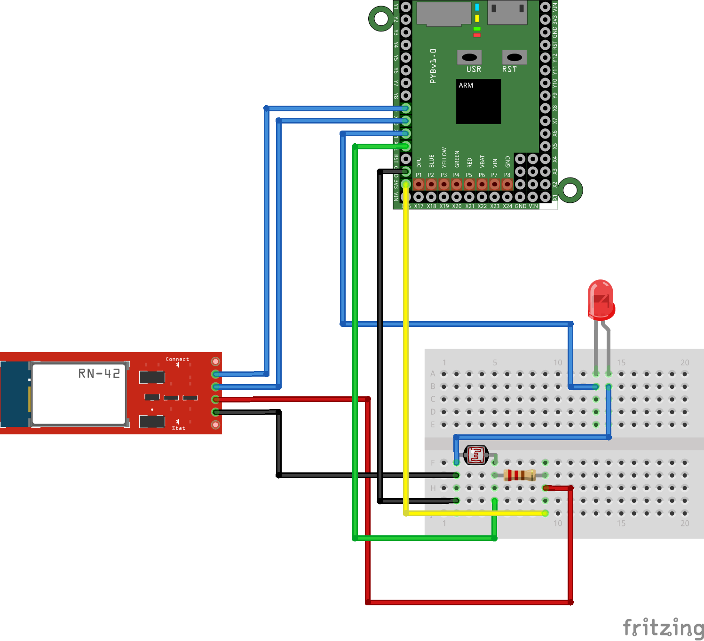
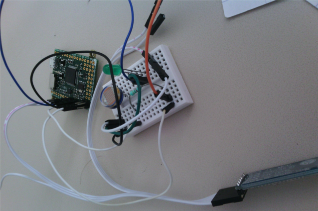

Cas d'Usage
===========

Le cas d'usage de Cohorte Micronode permettant de
valider le fait qu'il est possible de définir des composants
qui proposent des services consommables par des peers
distants et définir des composants qui consomment
des services exportés par des peers distants.

Dans notre cas, il s'agit d'un composant qui permet à un peer
distant d'allumer ou éteindre une LED. Et d'un composant qui
lit des valeurs sur une photorésistance et envoie ces valeurs
sur un service de stockage distant.

Ci-dessous le montage électronique réalisé pour ce use case :

Et me montage en image :

Définition de Composants Utilisateur
------------------------------------

Il est possible d'écrire dans le module *components* les différents
modules utilisateurs.

Un exemple pour le cas d'usage :

.. automodule:: components
    :members:
